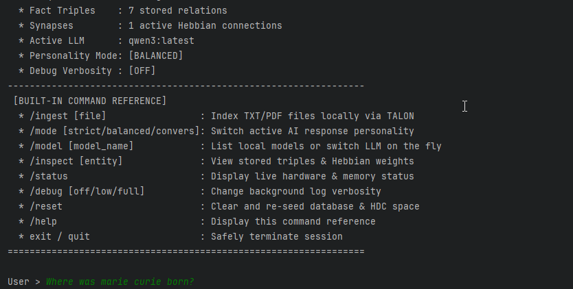
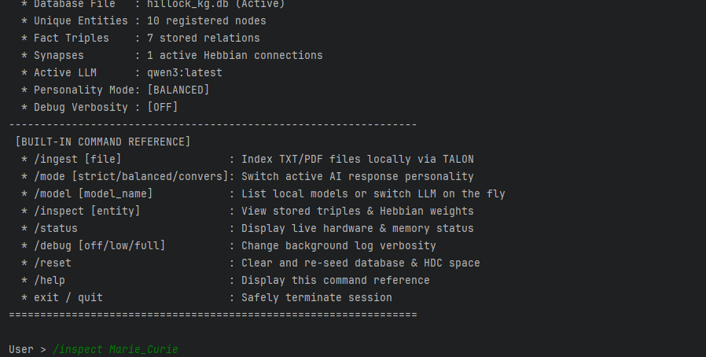
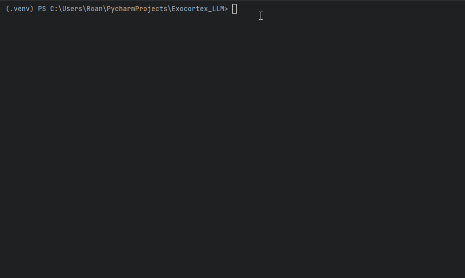
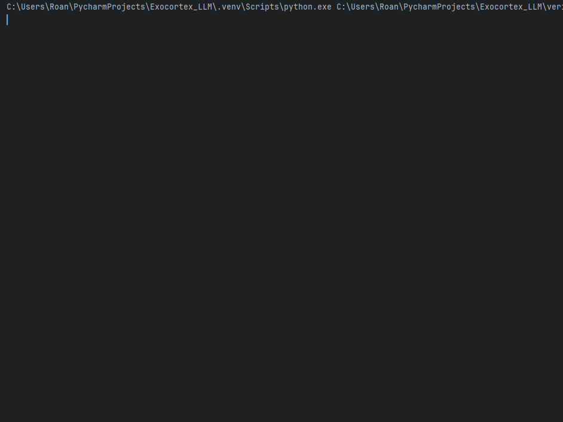

# Hillock 🧠

**A lightweight, 100% local neuro-symbolic memory engine built for edge hardware.**




**TL;DR**
* A local memory engine that answers from a knowledge graph, not a vector database, so there's no drift and no approximate matches standing in for facts.
* Ingests a document in ~5 seconds and runs the entire pipeline in under 1.2 GB VRAM (or CPU-only), instead of the 5-16 GB+ and long generation waits an LLM-based extraction pipeline needs.
* A hard, deterministic similarity gate blocks unanswerable questions before they ever reach the LLM, so it refuses honestly instead of generating a plausible-sounding guess.
* 100% offline: SQLite for facts, Hebbian weights for associative recall, and a 10,000-D hypervector space for sub-millisecond context matching. Ollama is only called once a question has already passed the gate.

### Contents
- [What's New in v0.5.0](#whats-new)
- [Architecture & Data Execution Flow](#architecture)
- [Why Skip Generative LLMs for Ingestion?](#why-skip-llms)
- [Mathematical Foundations](#math-foundations)
- [Benchmarking & Performance](#benchmarking)
- [Quick Start](#quick-start)
- [Interactive CLI Command Reference](#interactive-cli)
- [Verification Suite](#verification-suite)
- [Licensing & Contributions](#licensing)
- [Codebase Overview](#codebase-overview)

Traditional local RAG is surprisingly heavy. Running dense vector databases and using 8B+ generative LLMs just to parse documents and maintain long-term memory burns VRAM, chokes mid-range GPUs, and still hallucinates when asked about things it doesn't know.

**Hillock** was built to solve this. It replaces bloated vector databases and token-hungry extraction passes with a lightweight, three-tier architecture combining relational knowledge graphs, Hebbian synaptic memory, and 10,000-dimensional Vector Symbolic Architectures (VSA/HDC).

Extraction and gating run 100% offline on-device with zero cloud dependencies and zero API costs. TALON handles document parsing and similarity gating without ever calling an LLM, and stays comfortably within a **<1.2 GB VRAM footprint** (tested on a GTX 1070, and CPU-only where no CUDA device is present). A local LLM via Ollama is used only for the final response generation step, once a query has already passed the gate.

---

<a id="whats-new"></a>
## 🆕 What's New in v0.5.0: UX & Interactive Console Overhaul

v0.5 doesn't touch the extraction math, it makes the engine usable day-to-day:

* **1-Click Quickstart Launchers**: `run.bat` (Windows) and `run.sh` (Linux/Mac) handle venv creation, dependency install, and spaCy model provisioning, then drop you straight into the chat console.
* **Expanded Interactive CLI**: `/model`, `/inspect`, `/status`, and `/debug` join the existing `/ingest`, `/mode`, and `/reset` for live introspection into what the engine actually knows.
* **Token-Streaming Responses**: Ollama output now streams token-by-token to the console in real time, across all three personality modes.
* **20-Point CPU Verification Suite** (`verify_hillock.py`): exercises the knowledge graph, Hebbian math, VSA algebra, and gating logic with zero GPU dependency, so you can sanity-check a change without spinning up the CUDA stack.
* **Airtight Unseeded Evaluation** (`evaluate_hillock_PROTO_ish.py`): the benchmark harness now purges the seed graph before ingestion, separating true extraction performance from seed-data leakage, and reports Hard-Negative Block Rate as its own metric alongside Retrieval Accuracy.



---

<a id="architecture"></a>
## ⚙️ Architecture & Data Execution Flow

```text
       [ Raw Text / PDF Documents ]
                    │
                    ▼
   [ TALON Engine (CUDA-Accelerated / CPU-Compatible) ]
       ├── Stage 1: Coreference Resolution (Fastcoref)
       ├── Stage 2: Bi-Encoder Predicate Router (MiniLM <2ms)
       └── Stage 3: Zero-Shot Latent Relation Extractor (GLiREL Large)
                    │
                    ├──► [ SQLite Knowledge Graph ]  (Hard SPO Triples)
                    ├──► [ Hebbian Synaptic Engine ] (Co-Activation Plasticity)
                    └──► [ VSA / HDC Reservoir ]    (10,000-D Fingerprinting)
                                   │
                                   ▼
                      [ HDC Similarity Gating ]
                                   │
                    ┌──────────────┴──────────────┐
                    ▼                             ▼
        [ Passed Threshold ≥ 0.72 ]     [ Failed Similarity Gate ]
                    │                             │
                    ▼                             ▼
      [ LLM Response Generation ]     [ Hardcoded Refusal ]
        (Grounded Fact Rendering)     ("I do not have verified
         via streaming Ollama)          information about that.")
```

The gate is a hard cutoff, not a soft ranking signal. `HDC_THRESHOLD` in `config.py` is what `select_answering_facts()` checks a query/fact cosine similarity against before any fact is allowed to reach the LLM. It was recalibrated to 0.72 specifically to close hallucination leaks that a looser threshold let through, see the Benchmarking section for what that trade-off costs in recall.

### The Three Memory Layers

* 💾 **SQLite Knowledge Graph (`database.py`)**: Stores ground truth facts as Subject-Predicate-Object (SPO) triples in relational tables. No vector drift or approximation errors for factual memory.
* ⚡ **Hebbian Plasticity Engine (`plasticity.py`)**: Tracks co-occurring concepts across turns using gradient-free synaptic learning to mimic natural associative memory recall. Surfaced live via `/inspect`.
* 🌀 **Hyperdimensional Reservoir (`reservoir.py`)**: A 10,000-dimensional Vector Symbolic Architecture (VSA) hypervector space that compresses conversation context with a fading-memory decay of 0.95 per step, resolves pronouns, and hard-blocks unanswerable queries in under a millisecond.

---

<a id="why-skip-llms"></a>
## 💡 Why Skip Generative LLMs for Ingestion?

Asking an autoregressive LLM to read documents and output structured JSON is slow and wastes compute. Hillock uses tensor-based classification instead, which is dramatically faster and doesn't depend on an LLM staying well-behaved and formatting its output correctly:

| Metric / Dimension | Standard Local RAG (8B LLM) | Hillock (TALON + HDC) |
| --- | --- | --- |
| **Ingestion Latency (30-Sentence Doc)** | **15-30 minutes** (Autoregressive generation bottleneck). | **~5.05 seconds** (6.3 sent/sec pure GPU rate). |
| **VRAM Footprint** | ~5.8 GB - 16 GB+ (Needs large KV-caches and context windows). | **< 1.2 GB VRAM** (FP16 bi-encoder tensor matching). |
| **Pipeline Completion Rate** | ~85-94% (LLM output prone to syntax drift and malformed JSON, causing dropped extractions). | **100%** (Deterministic matrix operations, every sentence produces a structured output, though not every extraction is correct; see benchmarks below). |
| **Unanswerable Queries** | Burns 100-500 GPU tokens generating long hallucinated excuses. | **0 GPU generation cycles** (<1ms CPU gate shuts down the LLM entirely). |

Note the "100%" row above is about the pipeline *running to completion*, not about correctness, that's a separate question, covered honestly in the benchmarks section next.

---

<a id="math-foundations"></a>
## 🔬 Mathematical Foundations

The core VSA and synaptic learning mechanics rely on the following algebraic setup:

### 1. Bipolar Hypervector Space

Hypervectors operate over a $D = 10,000$ dimensional bipolar domain:

$$\mathcal{H} = \{-1, +1\}^D$$

### 2. VSA Algebraic Operations

* **Bundling (Superposition / Set Membership $\oplus$)**: Element-wise addition followed by deterministic thresholding (resolving exact zeros via index parity):

$$\mathbf{h}_{\text{bundle}} = \text{sign}\left(\sum_{k=1}^K \mathbf{h}_k\right)$$

* **Binding (Association / Role Encoding $\otimes$)**: Encodes variable-value pairs via the element-wise Hadamard product (equivalent to bitwise XOR in binary space):

$$\mathbf{h}_{\text{bind}} = \mathbf{h}_A \odot \mathbf{h}_B \quad \implies \quad \text{CosSim}(\mathbf{h}_{\text{bind}}, \mathbf{h}_A) \approx 0$$

* **Similarity Metric ($\text{CosSim}$)**: Normalized scalar product calculated directly in Hamming space:

$$\text{CosSim}(\mathbf{h}_A, \mathbf{h}_B) = \frac{1}{D} \sum_{i=1}^D h_{A,i} \cdot h_{B,i} = 1 - \frac{2 \cdot d_H(\mathbf{h}_A, \mathbf{h}_B)}{D}$$

A query/fact pair only reaches the LLM if this score clears `HDC_THRESHOLD = 0.72` (see `select_answering_facts()` in `main.py`).

### 3. Hebbian Synaptic Plasticity

Gradient-free updates strengthen connections between active entity nodes, fading over conversation turns via exponential decay:

$$w_{\text{new}} = w + \eta(1 - w) \quad (\text{where } \eta = 0.15, \text{ decay } \gamma = 0.01)$$

### 4. Locality-Sensitive Projection (SimHash)

Projects continuous dense embeddings $\mathbf{x} \in \mathbb{R}^d$ into bipolar space $\mathbf{h} \in \{-1, +1\}^D$ via random projection matrix $\mathbf{R} \in \mathbb{R}^{D \times d}$ while preserving cosine similarity:

$$\mathbf{h} = \text{sign}(\mathbf{R}\mathbf{x}) \quad \implies \quad \mathbb{E}[\text{CosSim}(\mathbf{h}_A, \mathbf{h}_B)] = 1 - \frac{2}{\pi}\arccos(\mathbf{x}_A \cdot \mathbf{x}_B)$$

This is what backs the GloVe-based continuous vectors (50-D, ~50K-word vocabulary, ~10MB RAM) used alongside the subword hypervector encoder.

---

<a id="benchmarking"></a>
## 📊 Benchmarking & Performance

**Heads up on scale:** this is currently a small, fixed benchmark: one 32-sentence complex academic text, 20 answerable questions, 10 hard-negative trick queries designed to trigger hallucinations. It's enough to catch regressions during development but not enough to claim statistical robustness yet. Treat the numbers below as directional, not final. A larger, more varied benchmark is planned before any v1.0 claims.

**On precision improvements:** v0.4 introduces $O(1)$ set-based schema constraints, direction auto-correction for origin predicates, and precompiled regex span sanitization, boosting raw extraction precision from 11.5% to **15.5%** while keeping ingestion fast and sub-second fast-eval retrieval intact.

Tests run cold on a fresh database:

| Version / Milestone | Extraction Recall | Gate Accuracy | Extraction Precision | Retrieval Accuracy | Ingestion Speed (Pure GPU) |
| --- | --- | --- | --- | --- |----------------------------|
| **v0.1.0 Baseline (Qwen LLM)** | 13.6% | 16.7% | 1.8% | 10.0% | ~15-30 minutes             |
| **v0.2.0 Raw TALON Engine** | 13.6% | 16.7% | 1.8% | 10.0% | 40s (Model Load)           |
| **v0.2.2 Quality Patch** | 50.0% | 43.3% | 7.6% | 45.0% | 35s                        |
| **v0.2.3 Audit Fixes** | 59.1% | 56.7% | 11.5% | 45.0% | 2.9 sent/sec               |
| **v0.2.4 Performance Fixes** | 59.1% | 60.0% | 11.5% | 50.0% | 7.4 sent/sec               |
| **v0.3.0 SimHash VSA** | 50.0% | 56.7% | 11.5% | 55.0% | 7.6 sent/sec               |
| **v0.4.1 Schema Precision** | 50.0% | 43.3% | 15.5% | 45.0% | 6.3 sent/sec               |
| **v0.5.0 UX Release*** | **50.0%** | **43.3%** | **15.5%** 🎉 | **45.0%** 🎉 | **6.3 sent/sec** 🎉       |

\* v0.5.0 carries the exact v0.4.1 numbers forward. This release only touched the console and tooling, the extraction pipeline itself is unchanged, so it wasn't re-benchmarked. What v0.5 *did* change is the harness: `evaluate_hillock_PROTO_ish.py` now clears the seed graph before ingesting, so the next milestone that touches extraction should be benchmarked fresh under the new unseeded harness rather than compared directly to these rows.

### What the numbers actually mean:

* **High Speed & Low Latency (6.3 sent/sec / 1.42s retrieval):** TALON ingests full documents in ~5.05 seconds, and the 30-query fast-eval benchmark completes in 1.42 seconds (~0.047s per query).
* **Solid Recall & Precision Jump (50.0% / 15.5%):** Schema filtering and direction auto-correction successfully eliminate inverted facts and clean span artifacts, raising precision to 15.5%.
* **New in v0.5's unseeded harness:** Retrieval Accuracy and Hard-Negative Block Rate are now reported separately (previously blended into one "Gate Accuracy" figure), so you can see whether the gate is failing by refusing answerable questions or by leaking on trick ones.

---

<a id="quick-start"></a>
## 🚀 Quick Start

### Prerequisites

* Python 3.10+
* [Ollama](https://ollama.com/) running locally, used only for final response generation, not extraction. Pull at least one instruct-tuned model; the project defaults to `qwen3:latest` in `config.py`, but any locally installed model works and you can switch between them at runtime with `/model [name]`.
* NVIDIA GPU with CUDA support recommended (8GB VRAM, e.g. GTX 1070). CPU-only execution is also supported, just slower on ingestion.

### Option A: 1-Click Launcher (recommended)

The launcher scripts create the virtual environment, install dependencies, check for the spaCy `en_core_web_sm` model (downloading it if missing), and start the console, no manual steps required.

**Windows:**
```bat
run.bat
```

**Linux / macOS:**
```bash
chmod +x run.sh
./run.sh
```



### Option B: Manual Setup

```bash
git clone https://github.com/roandejager/Hillock.git
cd Hillock

python -m venv .venv

# Windows
.venv\Scripts\activate
# Linux/Mac
source .venv/bin/activate

# Install PyTorch with CUDA first (adjust cu121/cu124 for your driver)
pip install torch torchvision torchaudio --index-url https://download.pytorch.org/whl/cu121

# Install remaining requirements
pip install -r requirements.txt

# Download English language model
python -m spacy download en_core_web_sm

python main.py
```

---

<a id="interactive-cli"></a>
## 🕹️ Interactive CLI Command Reference

Once the console is running, every message that isn't a command is treated as a chat turn, grounded facts stream back token-by-token from Ollama. Anything not covered by a verified fact gets a hardcoded refusal rather than a guess.

| Command | Description | Notes |
| --- | --- | --- |
| `/ingest [file]` | Index a local `.txt` or `.pdf` document via the TALON pipeline. | e.g. `/ingest notes.pdf` |
| `/mode [strict\|balanced\|conversational]` | Switch response personality and grounding strictness. | Default: `BALANCED`. No argument prints the current mode's usage. |
| `/model [name]` | List locally installed Ollama models (queried live from the Ollama API), or switch the active model. | No argument lists models and flags the active one. |
| `/inspect [entity]` | Show every stored SPO triple and Hebbian synaptic weight for an entity. | Entity names are fuzzy-resolved, so `/inspect turing` matches `Alan_Turing`. |
| `/status` / `/help` | Print the full system dashboard: hardware profile, DB stats, active LLM, personality mode, debug level, and this command list. | |
| `/debug [off\|low\|full]` | Set diagnostic verbosity. | `off`: clean output. `low`: memory priming traces. `full`: adds HDC cosine similarity scores per fact. Default: `OFF`. |
| `/reset` | Wipe the SQLite graph and HDC hypervector space, then re-seed both from scratch. | Irreversible for the current DB file. |
| `exit` / `quit` | Safely terminate the session. | |

**Personality modes:**
* `STRICT`: renders only the verified fact, one sentence, no added context.
* `BALANCED`: answers from verified facts, with a light touch of natural conversational framing.
* `CONVERSATIONAL`: same grounding guarantee, more expansive tone, pulls in Hebbian and HDC context traces for flavor.

All three modes share the same hard rule passed to the LLM: never invent a fact, date, or claim that isn't in the verified data.

---

<a id="verification-suite"></a>
## ✅ Verification Suite (`verify_hillock.py`)

A standalone, GPU-free test suite for checking the core mathematical invariants without spinning up the CUDA extraction stack:

```bash
python verify_hillock.py
```

| # | Domain | What it checks |
| --- | --- | --- |
| 1 | SQLite Knowledge Graph | Seed counts, single-valued predicate overwrite, stem-based predicate fallback. |
| 2 | Hebbian Engine | Strengthen step matches $\eta = 0.15$; decay step matches $\gamma = 0.01$. |
| 3 | VSA Reservoir | Encoding determinism, bipolar $\{-1,+1\}$ output, binding orthogonality. |
| 4 | v0.4 Extraction Helpers | Span cleaners (possessives, trailing verbs, prepositions), canonical triple keying, inverted-pair purging. |
| 5 | Coreference | Span replacement resolves correctly against character offsets. |
| 6 | Ingestion Path | Confirms the pipeline halts loudly (rather than silently degrading) when the TALON stack isn't available. |
| 7 | Benchmark Integrity | Seed-contamination arithmetic: how much overlap exists between the seed graph and eval targets. |
| 8 | Gate Score Distribution | Runs the full 30-query eval set through the gate and reports the score distribution against `HDC_THRESHOLD`. |

The suite prints a `PASS`/`FAIL` line per check and exits non-zero if anything fails, so it's safe to wire into CI without a GPU runner.



---

<a id="licensing"></a>
## ⚖️ Licensing & Contributions

Licensed under the **GNU Affero General Public License v3.0 (AGPL-3.0)**.

To keep the project open-source while preserving the option for future commercial dual-licensing, contributors must sign a standard **Contributor License Agreement (CLA)** via `cla-assistant.io` when opening a PR. See `CONTRIBUTING.md` and `CLA.md`.

---

<a id="codebase-overview"></a>
## 📂 Codebase Overview

* `config.py`: Hyperparameters (HDC dimensionality, Hebbian learning rates, similarity thresholds).
* `database.py`: SQLite triple store with micro-batched transactions.
* `plasticity.py`: Hebbian synaptic association engine.
* `reservoir.py`: 10,000-D VSA hypervector memory engine.
* `talon_engine.py`: 3-stage CUDA extraction pipeline (Fastcoref + MiniLM + GLiREL Large).
* `ingestor.py`: Document ingestion orchestrator and timing tracker.
* `main.py`: CLI chat console: command routing, gating logic, pronoun resolution, and streaming response rendering.
* `evaluate_hillock_PROTO_ish.py`: Automated, unseeded benchmarking suite.
* `verify_hillock.py`: GPU-free 20-point verification suite for core math and data invariants.
* `run.bat` / `run.sh`: One-click setup and launch scripts for Windows and Linux/macOS.
